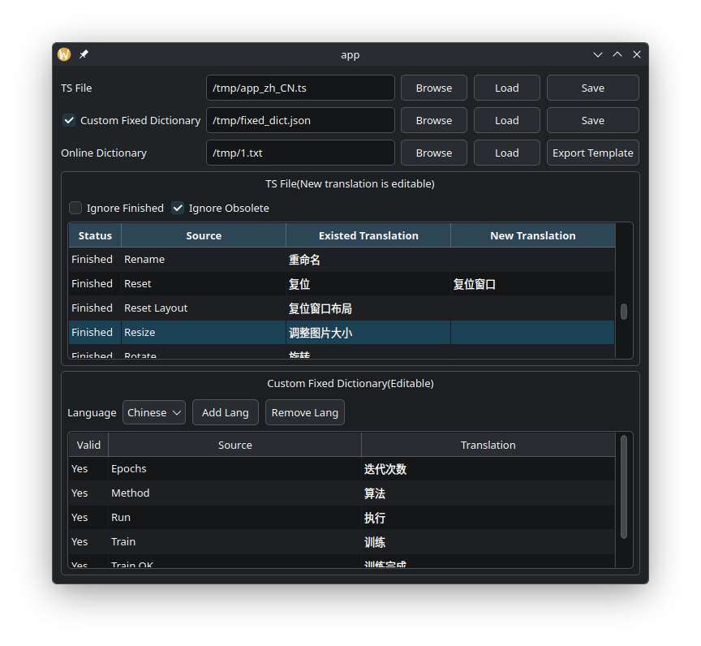

# Qt半自动翻译

Select Language: [English](README.md) | [简体中文](README.zh-CN.md)

一个简单的工具用于Qt的`*ts`文件，达到翻译不同语言的目的。借助网络翻译，可以节省时间。

## 简易步骤

第一步，打开ts文件，加载已有的字典

第二步：点击"Export Template"按钮，从ts文件生成txt文件，该纯文本每行内容，是`tr("xx")`中的xx，并且忽略上下文

> 该纯文本中，每一个回车符会替换成一个红色的emoji，注意保留该特殊符号，最终会进行逆操作替换回原回车符。

第三步，将该纯文本拖入翻译软件（可能需要转docx格式），如[Google Translate](https://translate.google.com)，翻译后得到translated.txt，加载该文件。

> 该文件总行数需要与dict表格行数一致。

第四步，点击"Save"应用翻译，此时会覆盖源ts文件

## 固定翻译

> 该功能与Qt语言家（Linguist）中的短语书（Phrase Book）类似，加载固定的生词映射。

有些翻译需要精确的人工翻译，或者特定的缩写术语，不能被自动翻译。此时可以使用"Fixed dict"功能

第一步：将dict表格中的某N行选中，右键菜单中添加到fixed dict。此时下方表格是可以编辑的。并且可以保存为json文件作为固定翻译。

第二步：重新做一遍简易步骤，即可导出自动翻译+人工固定翻译的ts文件

## 语言家

Qt5的老旧版本，没有按tr()顺序显示词语，可以使用较新的版本。如网友[单独编译的语言家](https://github.com/thurask/Qt-Linguist)

## 尚未实现

- [ ] 在QTableWidget的一个单元格内编辑多行文本